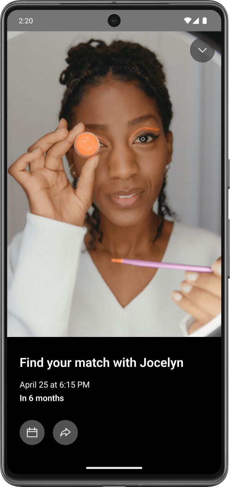
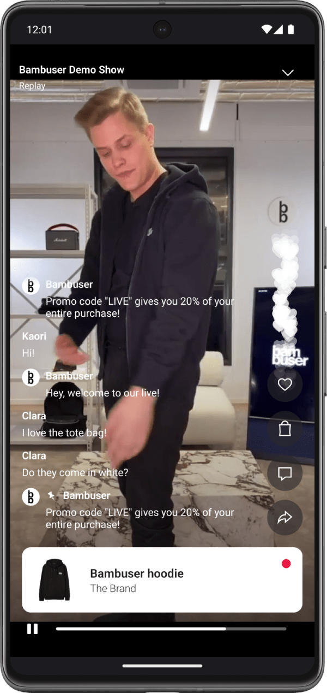
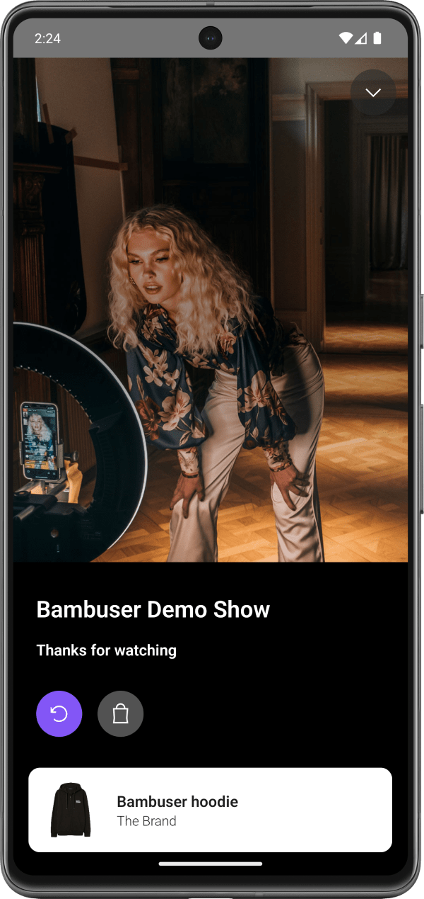
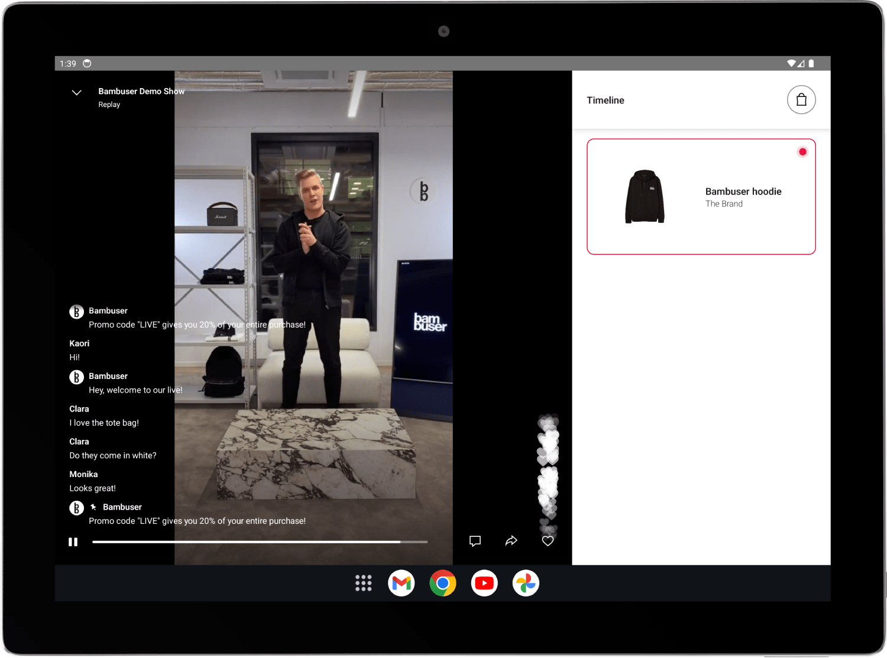

<div>
  <br/><br />
  <p align="center">
    <a href="https://bambuser.com" target="_blank" align="center">
        
    </a>
  </p>
  <br/><br />
</div>

# Bambuser Live Video Shopping Player

## About

This project contains a sample Android application showcasing the usage of Bambuser's Player SDK.

It can be significantly configured and lets you listen for player-emitted events and perform player-specific functions.

## How it looks

These are a few screenshots of the Player SDK in action.

<div>
	
	
	
	
</div>

## Requirements

This library targets Android 34, and the minimal support API is 26 (Android 8+)

## Setup

First, add a new maven repository to your dependency resolution management:

```
repositories {
        google()
        mavenCentral()
        // other repositories you might have...
        
        maven {
            url "https://repo.repsy.io/mvn/bambuser/default"
        }
    }
```

Then add the dependency into your `app/build.gradle`:

```
implementation "com.bambuser:player-sdk:(insert the latest version)"
```

## Getting started

An LVS player is a dedicated Android Activity that can be initialized in the following way:

```  
LVSPlayer.startActivity(
    context = Your Android context,
    showId = The ID of the show to watch,  
    configuration = Configuration(...), // Configuration that enable/disable features and UI elements in the player
    eventObserver = EventObserver(...), // Optional interface that receives the player events   
)
```

### Configuration

The player's attributes can be configured by providing a `Configuration` object when the `LVSPlayer` is created.
The supported properties are:

| Property                    | Type    | functionality                                                                                                                                                                         |
|-----------------------------|---------|---------------------------------------------------------------------------------------------------------------------------------------------------------------------------------------|
| `isEUServer`                | Boolean | Define if the show that is to be viewed is stored on an EU server or not                                                                                                              |
| `showHighlightedProducts`   | Boolean | Toggle the visibility of products during a show                                                                                                                                       |
| `showChat`                  | Boolean | Toggle the visibility of the chat during a show                                                                                                                                       |
| `showProductsOnEndCurtain`  | Boolean | Toggle the visibility of products on the end of the show curtain                                                                                                                      |
| `enablePictureInPicture`    | Boolean | Allow the player to be opened in Picture in Picture (PiP) mode                                                                                                                        |
| `enableProductDetailsPage`  | Boolean | Allow a Product Details Page (PDP) to be opened when a product highlight is clicked <br> If disabled, an OnProductHighlightClicked-Event will still be sent when a product is clicked |
| `showShoppingCart`          | Boolean | Toggle the visibility of an icon that opens the current shopping cart                                                                                                                 |
| `showLikes`                 | Boolean | Toggle the feature to send and view likes during a show                                                                                                                               |
| `preferredLocale`           | String  | Define which locale should be used when fetching localized strings, defaults to `en-US`                                                                                               |
| `showNumberOfViewers`       | Boolean | Toggle the visibility of the viewer count in the top bar                                                                                                                              |
| `conversionTrackingTTLDays` | Int     | Changes the expiration time for Conversion Tracking and consequently the duration of the time that purchases are being tracked, defaults to 30                                        |

### Events

If an `EventObserver` is provided when the `LVSPlayer` is created, the following events can be observed:

| Event                             | Emitted when                                                                                                                           | Parameters                                                                                                                                           |
|-----------------------------------|----------------------------------------------------------------------------------------------------------------------------------------|------------------------------------------------------------------------------------------------------------------------------------------------------|
| `OnPlay`                          | The show starts playing                                                                                                                | -                                                                                                                                                    |
| `OnPaused`                        | The show is paused by the viewer                                                                                                       | -                                                                                                                                                    |
| `OnSeek`                          | The viewer seeks during a show                                                                                                         | -                                                                                                                                                    |
| `OnProductHighlightClicked`       | A product is clicked                                                                                                                   | `product: Product` - A model representing the product that was clicked                                                                               |
| `OnSeekToProductHighlightClicked` | The seek button on a product card is clicked                                                                                           | `product: Product` - A model representing the product that was clicked                                                                               |
| `OnAddToCalendar`                 | The add to calendar button on the pre-live curtain is clicked, if the show has a scheduled start time                                  | `date: Long` - The shows scheduled start time <br> `title: String` - The title of the show <br> `description: String?` - The description of the show |
| `OnShare`                         | The share button is clicked                                                                                                            | -                                                                                                                                                    |
| `OnReplay`                        | The replay button on the ended-show curtain is clicked                                                                                 | -                                                                                                                                                    |
| `OnCartClicked`                   | The cart button is clicked                                                                                                             | -                                                                                                                                                    |
| `OnMessageSent`                   | A chat message is sent through the player                                                                                              | -                                                                                                                                                    |
| `OnTermsAndConditionsLinkClicked` | The user clicks on the link to view the terms and conditions for the chat                                                              | `link: String` - The link that was clicked                                                                                                           |
| `OnChatMessageLinkClicked`        | The user clicks on a link in a chat message                                                                                            | `link: String` - The link that was clicked                                                                                                           |
| `OnSendLike`                      | The user sends a like using the heart button, multiple likes within a short time span will be lumped together into the same event      | `count: Int` - The amount of likes that where sent                                                                                                   |
| `OnMessageReceived`               | A new message was received from the backend                                                                                            | -                                                                                                                                                    |
| `OnMinimizeClicked`               | The user clicks on the minimize button. This will make the player enter PiP mode if it is enabled. Otherwise the player will be closed | -                                                                                                                                                    |
| `PDPEvent.OnOpenClicked`          | The user clicks on the open button inside of the light PDP                                                                             | `product: Product` - A model representing the product to be opened                                                                                   |
| `OnError`                         | The player encounters an error                                                                                                         | `lvsPlayerError: LVSPlayerError` - The error that occurred                                                                                           |
| `OnClose`                         | The player was closed                                                                                                                  | -                                                                                                                                                    |

> Currently, whenever an `OnError` event is emitted, the `LVSPlayer` activity is destroyed. This behavior is likely going to change in future releases. 

An alternative way to observe the `LVSPlayerEvents` is to listen directly to a `LVSPlayerEvent`-flow from the `LVSPlayer`. This can be reached in the following way:

```
val lvsPlayerEventsFlow = LVSPlayer.observeEvents(playerId)
```

### Actions

The `LVSPlayer` can be used to perform actions on an initialized player.
A `playerId` must be provided to indicate which player the action should be performed on.

```  
val action = LVSPlayerInputAction.Play(playerId)
LVSPlayer.performAction(action)
```

The following actions are currently available:

| Action                 | Result                                                                      | Parameters                                                                                                                                                                                                                                                                                                     |
|------------------------|-----------------------------------------------------------------------------|----------------------------------------------------------------------------------------------------------------------------------------------------------------------------------------------------------------------------------------------------------------------------------------------------------------|
| `Minimize`             | If the player is not in PiP mode; it enters PiP mode                        | `playerId: String` - The id of the player where the action will be performed                                                                                                                                                                                                                                   |
| `Maximize`             | If the player is in PiP mode; it leaves PiP mode and returns to normal mode | `playerId: String` - The id of the player where the action will be performed                                                                                                                                                                                                                                   |
| `Close`                | The player is closed down and the activity ended                            | `playerId: String` - The id of the player where the action will be performed                                                                                                                                                                                                                                   |
| `Play`                 | The player attempts to start playing it's current show                      | `playerId: String` - The id of the player where the action will be performed                                                                                                                                                                                                                                   |
| `Pause`                | The player attempts to pause playing it's current show                      | `playerId: String` - The id of the player where the action will be performed                                                                                                                                                                                                                                   |
| `Replay`               | The player attempts to restart it's current show                            | `playerId: String` - The id of the player where the action will be performed                                                                                                                                                                                                                                   |
| `SendLike`             | A like is sent to the current show                                          | `playerId: String` - The id of the player where the action will be performed <br> `count: Int = 1` - The amount of likes to send any value given will be coerced between 1 and 100 <br> `duration: Double = 100.0` - The duration of the likes to send, any value given will be coerced between 1.0 and 1000.0 |
| `ToggleChatVisibility` | The visibility of the chat is toggled                                       | `playerId: String` - The id of the player where the action will be performed                                                                                                                                                                                                                                   |

### Player SDK

The `LVSPlayer` can be used to perform actions with data collected during a show.

```  
LVSPlayer.trackPurchase(context, isEUServer, orderId, orderValue, orderProductIds, currency, orderCountry)
```

The following actions are currently available:

| Action              | Result                         | Parameters                                                                                                                                                                                                                                                                                                                                                                                |
|---------------------|--------------------------------|-------------------------------------------------------------------------------------------------------------------------------------------------------------------------------------------------------------------------------------------------------------------------------------------------------------------------------------------------------------------------------------------|
| `trackPurchase`     | Perform conversion tracking    | `context` - Application context <br> `isEUServer` - Is the server restricted to EU <br> `orderId` - The id of the order <br> `orderValue: Double` - Total amount of the order <br> `orderProductIds: List<String>` - Product id's of sold products <br> `currency: String` - Currency used in transaction <br> `orderCountry: String? = null` - Country in which the transaction was made |
| `clearTrackingData` | Clear conversion tracking data | `context` - Application context <br> `isEUServer` - Is the server restricted to EU                                                                                                                                                                                                                                                                                                        |


## Work Manager
You might find issues when using custom worker factories in your Android application after initializing the `LVSPlayer`. If that is your case, merge your factories with our `LVSWorkerFactory` with the help of the `DelegatingWorkerFactory`. See the example below:

```
val factory = DelegatingWorkerFactory()
	.apply {
            addFactory(yourCustomFactory) // Add your factories
            addFactory(LVSWorkerFactory()) // This is our own worker factory
        }

val conf = Configuration.Builder()
	.setWorkerFactory(factory)
	// Other configurations you might have...
        .build()

WorkManager.initialize(yourContext, conf)
```

## Demo app

The `app` folder contains a demo app, which can be used as an example of how to set up and configure an `LVSPlayer`.

## Known Issues
- Closing PiP does not stop the player instance, and the audio keeps playing until you close the app. Bambuser would recommend to not use PiP until this issue is resolved
- App crashes intermittently when using the seek bar and closes the player, with an IllegalStateException related to MediaPlayer.getCurrentPosition ([Issue](https://github.com/bambuser/BambuserPlayerSDK-Android/issues/10))
